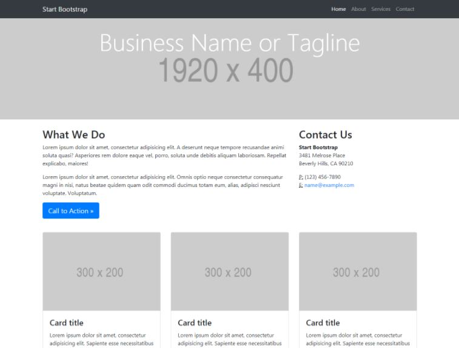
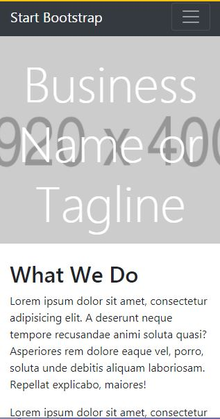
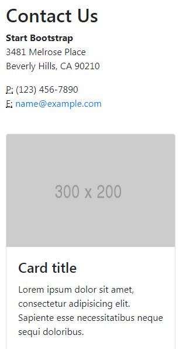

# Mi página

* **Track:** _Common Core_
* **Curso:** _Creando tu primera red social_
* **Unidad:** _La web desde un móvil_

***

En este reto, vamos a realizar una página a nuestro gusto.

El diseño lo puedes realizar como mejor te parezca, pero debes mantener la estructura de la página y debes realizarlo con un grid (cualquiera pero que no sea un framework como Bootstrap o Materialize). La estructura de la página es la siguiente:

## Objetivos del reto

El reto consiste en:

* Crear una web que sea responsiva.
* Usar Grid System y Media Query.
* Implementar `gh.pages`

## Logro

## Herramientas usadas

* HTML 

* CSS 

* Grid System 

* Media Query 